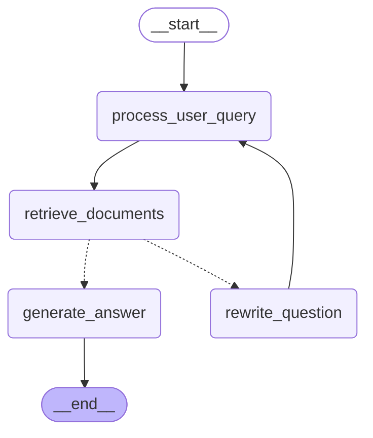

# KMA RAG Chatbot - Agentic RAG and Backend

# Agentic RAG

An intelligent chatbot for answering questions about regulations at the Academy of Cryptographic Techniques (KMA). This project uses LangChain, LangGraph, and Ollama to provide accurate responses to user queries about KMA's regulations.

## Features
- **Hybrid Retrieval**: Combines vector search (FAISS) and keyword search (BM25) for optimal information retrieval
- **Intelligent Rewriting**: Improves queries that don't initially match relevant documents
- **Relevance Grading**: Evaluates document relevance to ensure accurate responses
- **Streamlit UI for test**: Clean Streamlit interface for easy interaction
- **Multi-language Support**: Fully supports Vietnamese language for both queries and responses

## Mermaid Diagram



## How to run streamlit app

1. Install the required packages:
   ```bash
   poetry install
   ```
2. Activate the virtual environment:
   ```bash
   poetry env activate
   ```
   
3. Run the Streamlit app:
   ```bash
     streamlit run src/rag/streamlit_app.py 
    ```

