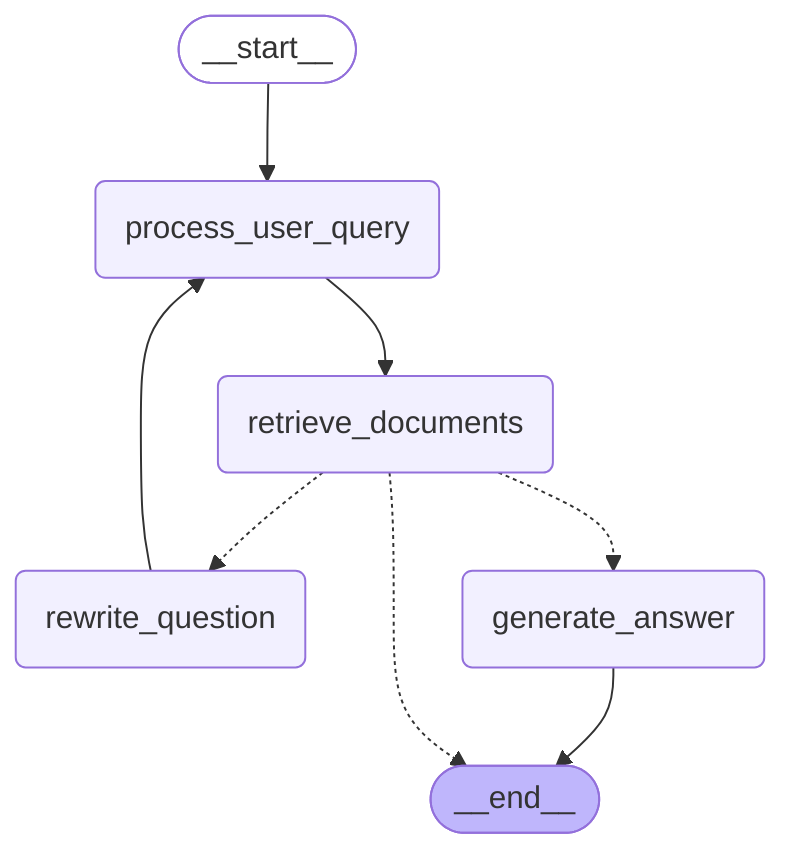
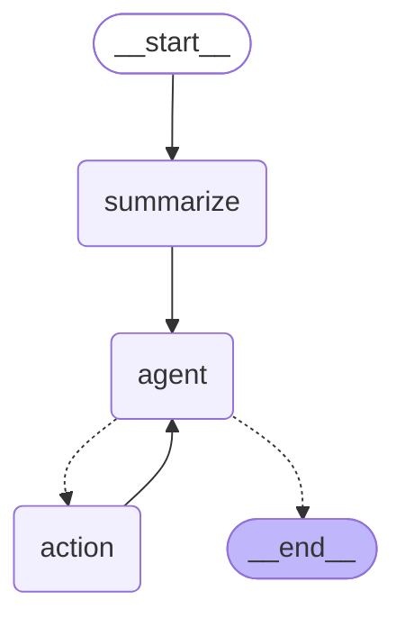

# KMA Chat Agent

A powerful conversational AI system combining RAG (Retrieval-Augmented Generation) with a ReAct AI agent, equipped with specialized tools for student information retrieval and processing.

## Table of Contents

- [RAG Agentic](#rag-agentic)
- [ReAct AI Agent with Tools and RAG Agentic](#react-ai-agent-with-tools-and-rag-agentic)
- [Backend API](#backend-api)
- [Streamlit App](#streamlit-app)
- [Running the Application](#running-the-application)

## RAG Agentic

### Architecture

The RAG (Retrieval-Augmented Generation) component enhances the AI's responses by retrieving relevant information from a knowledge base before generating answers.

```
Query → Document Retrieval → Context Augmentation → LLM Generation → Response
```

### Workflow Visualization

The following Mermaid diagram shows the agent's workflow graph:



### Tech Stack

- **Langchain**: Framework for RAG implementation
- **Vector Database**: For document indexing and semantic search
- **Python 3.12**: Core programming language
- **Gemini LLM**: Base language model

### Features

- Semantic search across knowledge documents
- Context-aware responses based on retrieved information
- Handles domain-specific knowledge about the educational system

### Installation and Setup

```bash
# Clone the repository
git clone https://github.com/yourusername/kma_chat_agent.git
cd kma_chat_agent

# Install dependencies
pip install -r requirements.txt

# Set up environment variables
cp .env.example .env
# Edit .env with your API keys and configuration

# Index your documents (example)
python src/rag/indexing.py
```

## ReAct AI Agent with Tools and RAG Agentic

### Architecture

The ReAct (Reasoning and Acting) Agent combines:

1. Reasoning through an LLM
2. Tool usage for specialized functions
3. Memory for maintaining conversation context
4. RAG for knowledge retrieval

The system uses LangGraph to orchestrate the workflow:

```
User Query → Conversation Memory → Query Summarization → Agent Reasoning → Tool Selection → Tool Execution → Response Generation
```

### Workflow Visualization

The following Mermaid diagram shows the agent's workflow graph:



### Tech Stack

- **LangGraph**: For creating the agent workflow
- **Langchain**: For agent components and tools integration
- **Gemini LLM**: Base language model
- **Python 3.12**: Core programming language

### Features

- Conversational memory to maintain context across multiple turns
- Specialized tools:
  - Student score retrieval
  - Student information lookup
  - Score calculation and analytics
  - RAG for knowledge retrieval
- Reasoning over multiple steps to solve complex queries

### Installation and Setup

```bash
# Make sure you've installed base requirements
pip install -r requirements.txt

# Run the example conversation
python src/agent/example_conversation.py

# View the agent workflow graph
# The graph is generated as a Mermaid diagram in the mermaid directory
```

## Backend API

### Architecture

The backend provides a RESTful API for:

1. User authentication
2. Conversation management
3. Message processing through the AI agent
4. Data persistence in MongoDB

```
Client Request → FastAPI Router → Business Logic → Agent Processing → Database → Response
```

### Tech Stack

- **FastAPI**: High-performance web framework
- **MongoDB**: Document database for storing conversations and messages
- **Pydantic**: Data validation and settings management
- **JWT**: Authentication mechanism
- **Python 3.12**: Core programming language

### Features

- RESTful API endpoints for conversation and message management
- User authentication and authorization
- Persistent storage of conversations and message history
- Rate limiting and request validation
- Conversation memory management

### Installation and Setup

```bash
# Install MongoDB
# Follow instructions at https://docs.mongodb.com/manual/installation/

# Set up environment variables
# Make sure MongoDB connection string is set in .env

# Run the API server
uvicorn src.backend.main:app --reload --port 8000

# API will be available at http://localhost:8000
# Swagger documentation at http://localhost:8000/docs
```

## Streamlit App

### Architecture

The Streamlit app provides a user-friendly interface to interact with the AI system.

```
User Interface → API Requests → Backend Processing → UI Updates
```

### Tech Stack

- **Streamlit**: Python framework for creating web apps
- **Streamlit Chat**: UI components for chat interfaces
- **Python 3.12**: Core programming language
- **HTTP Requests**: For API communication

### Features

- Clean, intuitive chat interface
- Conversation history management
- Real-time message updates
- Student information display
- Mobile-friendly responsive design

### Installation and Setup

```bash
# Install Streamlit dependencies
pip install streamlit streamlit-chat

# Make sure backend API is running

# Run Streamlit app
streamlit run src/frontend/app.py

# App will be available at http://localhost:8501
```

## Running the Application

For convenience, a `run.sh` bash script is provided to easily run the backend API, the Streamlit frontend, or both together.

### Using the Run Script

First, make the script executable:

```bash
chmod +x run.sh
```

Then you can run the application with various options:

```bash
# Run both backend and frontend (default)
./run.sh

# Run only the backend
./run.sh --backend

# Run only the frontend
./run.sh --frontend

# Run with custom ports
./run.sh --backend-port 9000 --frontend-port 8502

# Show help
./run.sh --help
```

### Run Script Features

- **Flexible Configuration**: Easily specify which components to run
- **Custom Ports**: Change the default ports for each service
- **Graceful Shutdown**: Properly stops all services with Ctrl+C
- **Colorful Output**: Clear visual indicators for different statuses
- **Process Management**: Keeps track of running processes

### Script Options

| Option            | Description                             | Default |
| ----------------- | --------------------------------------- | ------- |
| `--help`          | Show help information                   | -       |
| `--backend`       | Run only the backend API                | -       |
| `--frontend`      | Run only the Streamlit frontend         | -       |
| `--all`           | Run both backend and frontend           | Yes     |
| `--backend-port`  | Set the port for the backend API        | 8000    |
| `--frontend-port` | Set the port for the Streamlit frontend | 8501    |

## Getting Started

To run the entire system:

1. Start MongoDB:

```bash
mongod --dbpath /path/to/data/directory
```

2. Use the run script to start both backend and frontend:

```bash
./run.sh
```

3. Access the application at http://localhost:8501

## Environment Variables

Create a `.env` file with the following variables:

```
# LLM API Keys
GEMINI_API_KEY=your_gemini_api_key

# MongoDB
MONGODB_CONNECTION_STRING=mongodb://localhost:27017
MONGODB_DATABASE_NAME=kma_chat_agent

# JWT Authentication
JWT_SECRET_KEY=your_jwt_secret
JWT_ALGORITHM=HS256
ACCESS_TOKEN_EXPIRE_MINUTES=30
```

## Project Structure

```
kma_chat_agent/
├── mermaid/                  # Generated workflow diagrams
├── src/
│   ├── agent/                # ReAct agent implementation
│   │   ├── prompts/          # Agent prompts
│   │   ├── supervisor_agent.py
│   │   └── state.py
│   ├── backend/              # FastAPI backend
│   │   ├── api/              # API routes
│   │   ├── db/               # Database connections
│   │   ├── models/           # Pydantic models
│   │   └── main.py           # API entry point
│   ├── frontend/             # Streamlit frontend
│   │   └── app.py            # Streamlit application
│   ├── llm/                  # LLM configuration
│   ├── rag/                  # RAG implementation
│   └── score/                # Student score tools
└── requirements.txt          # Project dependencies
```

## License

[MIT License](LICENSE)

## Acknowledgements

- [LangChain](https://www.langchain.com/)
- [LangGraph](https://python.langchain.com/docs/langgraph)
- [FastAPI](https://fastapi.tiangolo.com/)
- [Streamlit](https://streamlit.io/)
