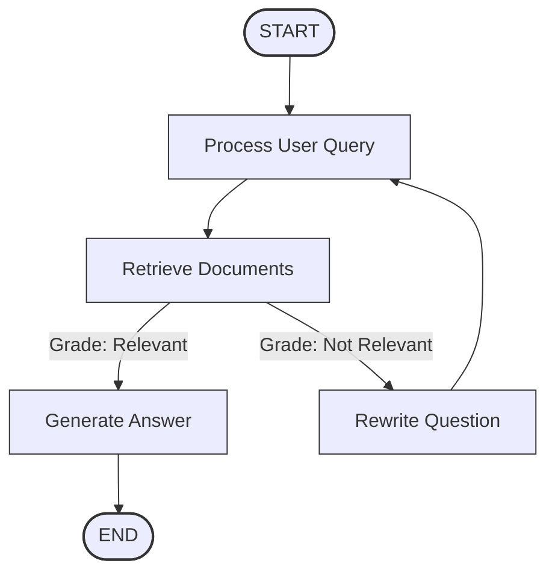

# KMA RAG Chatbot - Agentic RAG and Backend

# Agentic RAG

An intelligent chatbot for answering questions about regulations at the Academy of Cryptographic Techniques (KMA). This project uses LangChain, LangGraph, and Ollama to provide accurate responses to user queries about KMA's regulations.

## Features
- **Hybrid Retrieval**: Combines vector search (FAISS) and keyword search (BM25) for optimal information retrieval
- **Intelligent Rewriting**: Improves queries that don't initially match relevant documents
- **Relevance Grading**: Evaluates document relevance to ensure accurate responses
- **Streamlit UI for test**: Clean Streamlit interface for easy interaction
- **Multi-language Support**: Fully supports Vietnamese language for both queries and responses

## Mermaid Diagram




## How to run streamlit app

1. Install the required packages:
   ```bash
   poetry install
   ```
2. Activate the virtual environment:
   ```bash
   poetry env activate
   ```
   
3. Run the Streamlit app:
   ```bash
     streamlit run src/agent/streamlit_app.py 
    ```

# KMA Chat Agent Backend API

A FastAPI backend for the KMA Chat Agent, providing conversational AI capabilities for students of the Academy of Cryptography Techniques.

## Features

- MongoDB integration for data storage
- CRUD operations for users, conversations, and messages
- Conversation sharing mechanism
- Chat history management
- Integration with the existing KMA Chat Agent

## API Endpoints

### Users

- `POST /api/users` - Create a new user
- `GET /api/users/{user_id}` - Get user by ID
- `GET /api/users/by-student-code/{student_code}` - Get user by student code
- `PUT /api/users/{user_id}` - Update a user
- `DELETE /api/users/{user_id}` - Delete a user (soft delete)

### Conversations

- `POST /api/conversations` - Create a new conversation
- `GET /api/conversations?user_id={user_id}` - Get all conversations for a user
- `GET /api/conversations/{conversation_id}` - Get conversation by ID
- `PUT /api/conversations/{conversation_id}` - Update a conversation
- `DELETE /api/conversations/{conversation_id}` - Delete a conversation (soft delete)
- `POST /api/conversations/{conversation_id}/share` - Share a conversation
- `POST /api/conversations/{conversation_id}/unshare` - Unshare a conversation
- `GET /api/conversations/shared/{share_token}` - Get shared conversation by token

### Messages

- `POST /api/messages` - Create a new message
- `GET /api/messages/{message_id}` - Get message by ID
- `GET /api/messages/conversation/{conversation_id}` - Get all messages for a conversation
- `GET /api/messages/shared/{share_token}` - Get all messages for a shared conversation
- `PUT /api/messages/{message_id}` - Update a message
- `DELETE /api/messages/{message_id}` - Delete a message (soft delete)

### Chat

- `POST /api/chat/query` - Send a query to the chatbot

## Running the Application

### Development mode

```
poetry run python -m app.main run_backend_dev
```

### Production mode

```
poetry run python -m app.main run_backend
```

## API Documentation

When the server is running, you can access the API documentation at:
- Swagger UI: `http://localhost:8000/docs`
- ReDoc: `http://localhost:8000/redoc`
